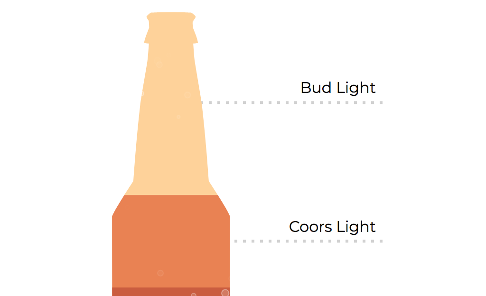

# Das Bier

This is just a simple chart built with [d3](https://d3js.org/).

It uses a pre-drawn path for clipping the underlying rectangles and get a beer bottle shape.

## Screenshot

## See it running

Got to [https://carlosyslas.com/das-bier](https://carlosyslas.com/das-bier).
